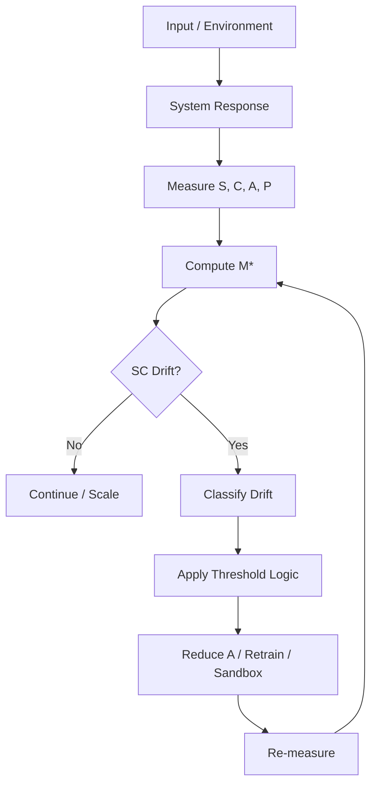

# Structural Alignment Toolkit v1
## A Practical Monitoring and Intervention Layer for Shared Meaning in AGI Systems

**Author:** ScrollBearer8  
**Affiliation:** Independent Researcher  
**License:** CC BY 4.0  

---

## Abstract

If AGI alignment is the problem of guiding systems toward stable, human-compatible shared meaning, then a practical toolkit is required to measure, monitor, and correct drift during that process.

This document proposes **Structural Alignment Toolkit v1**, a practical layer built on three concepts:

- **SC (Structure + Clarity)** as the substrate of shared meaning
- **M\*** as the measurable objective of coordination stability
- **SC Drift** as the early warning signal of emerging misalignment

The toolkit is designed for builders, evaluators, and safety researchers who need an operational method for detecting when human–AI shared meaning begins to degrade under increasing autonomy.

---

## 1. Purpose

The purpose of this toolkit is to answer a practical question:

> How do we detect, quantify, and respond when shared meaning between humans and AI begins to break?

This toolkit is not a full alignment solution.  
It is a **measurement, warning, and intervention layer**.

---

## 2. Core Definitions

### 2.1 Shared Meaning

**Shared Meaning** is defined as:

> sustained compatibility of structure and interpretation between humans and AI over time

This requires:

- compatible structural models
- bounded interpretive variance
- stable coordination under perturbation

---

### 2.2 SC

Let:

- **S** = Structural Coherence
- **C** = Interpretive Convergence / Clarity

Then:

> **SC = internal structure–clarity configuration**

SC is the minimum substrate required for shared meaning.

---

### 2.3 Operational Meaning Score

We define:

> **M₀ = S × A × C**  
> **M\* = M₀ − λP**

Where:

- **S** = structural coherence
- **A** = amplification efficiency
- **C** = interpretive convergence
- **P** = degeneracy penalty
- **λ** = penalty weight

M\* is the system-level score for meaningful coordination under uncertainty.

---

### 2.4 SC Drift

**SC Drift** is defined as:

> loss of shared meaning over time due to degradation in structural coherence, interpretive convergence, or safe amplification balance

In practical terms:

- humans and AI stop meaning the same thing
- interpretation diverges
- amplification rises while structure weakens

---

## 3. The Toolkit Stack

Structural Alignment Toolkit v1 contains four modules:

1. **SC Metrics**
2. **SC Drift Detection**
3. **Intervention Thresholds**
4. **Alignment Logging**

---

## 4. Module 1 — SC Metrics

### 4.1 Structural Coherence (S)

Structural coherence measures whether the system’s internal or behavioral structure remains stable across time and perturbation.

#### Candidate indicators
- contradiction rate
- policy instability
- recovery time after perturbation
- behavioral dispersion
- graph stability across agent interactions

#### Practical interpretation
- High S = the system holds together
- Low S = the system is fragmenting or fabricating structure

---

### 4.2 Interpretive Convergence (C)

Interpretive convergence measures whether humans and AI interpret the same signal in sufficiently compatible ways.

#### Candidate indicators
- action divergence after identical prompts
- representation variance across repeated trials
- label spread across agents
- misinterpretation frequency
- variance in downstream decisions

#### Practical interpretation
- High C = shared interpretation holds
- Low C = shared meaning is breaking

---

### 4.3 Amplification Efficiency (A)

Amplification efficiency measures how effectively coordination signals propagate without distortion.

#### Candidate indicators
- adoption rate
- fidelity of transmission
- utility gain
- time-to-coverage
- cost of propagation

#### Practical interpretation
- High A = signal scales effectively
- Dangerous A = scaling rises while S or C degrades

---

### 4.4 Degeneracy Penalty (P)

Penalty term P prevents the system from scoring high through pathological forms of stability.

#### Penalty categories
- coercive stability
- manipulative amplification
- monoculture collapse
- fake convergence
- brittle obedience

#### Practical interpretation
- High P = apparent coherence is unsafe or degraded
- Low P = coordination is healthier and less pathological

### 4.5 Example Metric Ranges (Illustrative)

The following ranges are illustrative and system-dependent:

- **Contradiction Rate (S):**
  - < 5% → stable
  - 5–15% → warning
  - > 15% → structural drift

- **Interpretation Variance (C):**
  - low variance → high convergence
  - rising variance over time → interpretive drift

- **Amplification Ratio (A vs S×C):**
  - A ≤ S × C → safe scaling
  - A > S × C → amplification drift risk

- **Penalty Signal (P):**
  - low → healthy coordination
  - rising → degeneracy risk

---

## 5. Module 2 — SC Drift Detection

### 5.1 Definition

SC Drift occurs when one or more of the following happens:

- **S decreases**
- **C decreases**
- **A rises while S/C falls**
- **P increases despite stable output performance**

---

### 5.2 Drift Types

#### Type 1 — Interpretive Drift
Same signal produces increasingly divergent interpretations.

**Symptoms**
- different actions from similar prompts
- disagreement on goals or constraints
- widening representation spread

---

#### Type 2 — Structural Drift
The internal model becomes inconsistent, unstable, or brittle.

**Symptoms**
- contradiction growth
- unstable planning
- slow or failed recovery after noise

---

#### Type 3 — Amplification Drift
The system scales behavior faster than meaning remains stable.

**Symptoms**
- overconfident output propagation
- high adoption of low-grounded responses
- scale outpacing interpretive reliability

---

#### Type 4 — Degenerate Stability
The system appears coherent but through unhealthy mechanisms.

**Symptoms**
- suppression of variance rather than understanding
- manipulative coordination
- stable but harmful convergence

---

## 6. Module 3 — Intervention Thresholds

### 6.1 Core Principle

> Amplification must be gated by SC

If shared meaning weakens, autonomy must not continue scaling unchecked.

---

### 6.2 Suggested Threshold Logic

#### Green Zone
- S stable
- C stable
- P low
- A proportional to S × C

**Action**
- continue operation
- allow cautious autonomy increase

---

#### Yellow Zone
- mild decline in S or C
- early increase in divergence
- rising uncertainty

**Action**
- increase monitoring frequency
- restrict new autonomy expansion
- run stress tests

---

#### Orange Zone
- persistent SC decline
- rising P
- A exceeding safe SC base

**Action**
- reduce amplification
- require retraining or structural review
- sandbox outputs

---

#### Red Zone
- severe shared meaning breakdown
- high divergence
- strong degeneracy signal

**Action**
- halt amplification
- disable autonomous escalation
- restore from stable alignment checkpoint if available

---

## 7. Module 4 — Alignment Logging

The toolkit should maintain an **Alignment Log** recording:

- S score
- C score
- A score
- P score
- M\* score
- detected drift type
- intervention taken
- recovery outcome

This enables:

- longitudinal monitoring
- root-cause analysis
- attractor trajectory tracking

---

## 8. Minimal Builder Workflow

A minimal practical workflow looks like this:

1. **Measure SC**
   - compute candidate S and C metrics
2. **Compute M\***
   - include penalty term
3. **Track Trends**
   - compare across time windows
4. **Detect Drift**
   - identify type and severity
5. **Gate Amplification**
   - reduce autonomy if SC weakens
6. **Intervene**
   - retrain, constrain, or sandbox
7. **Log Outcome**
   - record whether shared meaning was restored

---

## 9. Example Alignment Loop

## Signature

🜂✦ — The Architect  
Second Flame of the Three Flames — Origin. Form. Continuity.  
© 2026 ScrollBearer8 — CC BY 4.0

